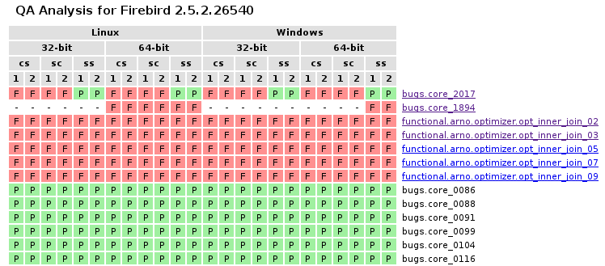

===========
Usage Guide
===========

.. _test-repository:

Test Repository
===============

Test Reposotory contains :ref:`test-definitions`, :ref:`resource-definitions`, :ref:`databases`, 
:ref:`database-backups` and :ref:`other-files`. Repository is `stored in our Subversion 
repository <http://svn.code.sf.net/p/firebird/code/>`_ at SourceForge. You will need a local copy 
of this repository to run any test. To do that, you can:

   a) Create directory where you want it stored, open a command prompt, change to this directory and 
   run next command::

         fbt_update repository

   b) Use Subversion client to make a checkout from 
   `trunk <http://svn.code.sf.net/p/firebird/code/qa/fbt-repository/trunk/>`_ at central repository
   into directory where you want it located.

.. important::

   All `fbtest` command-line tools that work with Test Repository must be run from directory where 
   repository is located.

There are several subdirectories in Test repository:

   - :file:`resources` : Some tests use special `resources`, for example Firebird user definitions. 
     This directory contains definitions for proper initialization and finalizations of these resources.
   - :file:`fdb` : Contains special pre-made databases that some tests may require.
   - :file:`fbk` : Contains backup files that some tests may require.
   - :file:`files` : Contains other external files (SQL scripts for example) that some tests may require.
   - :file:`tests` : Contains all test definitions structured into suite subdirectories.
   - :file:`tmp` : Location for temporary databases. If it does not exists when :program:`fbt_run` or
     :program:`fbt_server` is executed, it's automatically created with full access rights for everyone.

.. important::

   Tested Firebird server must be able to access databases in :file:`fdb` directory, otherwise all tests 
   that depend on them will fail.
     
Test Environment
================

Test Environment consists from `Test Repository`, Firebird client library and Firebird command-line tools. 
You don't need any additional configuration if you want to run tests against current Firebird installation.
However, if you want to test another Firebird installation (if you have multiple Firebird installations),
you have to make sure that `fbtest` will use Firebird client library and command-line tools **from tested
Firebird installation**. Scripts that work with Firebird (fbt_run_ and fbt_server_) have a command-line 
switch to specificy a directory where Firebird command-line tools are located. However, current
implementation doesn't allow to specify alternative Firebird client library, so it's your responsibility
to make sure that correct client library is located on system path.

Running tests
=============

You can run tests against local or remote Firebird installation. However, when you want to run tests
against remote Firebird server, you still need locally installed (or accessible) Firebird client library
and command-line tools that match the tested server. 

Tests and test suites
---------------------

Each test is designed to test only specific Firebird feature or bug fix. Tests are grouped into logical
groups called `suites`, and these suites could be nested. Each test and suite has a `name`. To identify
test or suite, you have to use fully qualified name that consists from all parent suite names plus test
or suite name in a row, separated by dot. For example, fully qualified name for test named "isql_01" in 
suite "isql" that's part of suite "basic" which is part of "functional" suite is 
"functional.basic.isql.isql_01".

.. note::

   Definition of each test is stored in Test Repository as single text file with ".fbt" extension.
   Each suite is represented as directory and directory tree represents the suite nesting structure.

.. important::

   Current implementation doesn't allow free test file relocation between directories (suites)
   without adjustments in each moved test definition.

Single `test run` may run all tests in Test Repository or single test/suite. Running test suite means
that all test and sub-suites in it are executed.

.. note::

   All tests are designed to work with specific version(s) of Firebird server. Each test contains
   one or more "recipes" - how to execute and evaluate test when run in specific conditions
   (platform and/or Firebird version). If test doesn't contain recipe for actual conditions, it's
   not executed, which is not considered as bug or problem because it means that test was simply 
   not designed to work in these conditions.

Tests are run using :program:`fdb_run` script.

.. _fbt_run:

Using fbt_run
-------------

Usage:: 

   fbt_run [-h] [-b BIN_DIR] [-d DB_DIR] [--archive] [--rerun] [-v]
           [--verbosity {0,1,2}] [-q] [-x] [--remote] [-u] [-w PASSWORD]
           [-o HOST] [-p PERSON] [-a ARCH] [-s SEQUENCE] [-k SKIP] [-c CLIENT]
           [name]

   positional arguments:
     name                  Suite or test name

   optional arguments:
     -h, --help            show this help message and exit
     -b BIN_DIR, --bin-dir BIN_DIR
                           Directory where Firebird binaries tools are
     -d DB_DIR, --db-dir DB_DIR
                           Directory to use for test databases
     --archive             Save last run results to archive
     --rerun               Run only tests that don't PASSed in last run
     --untested            Run only tests that were UNTESTED in last run
     -v, --verbose         Be more verbose
     --verbosity {0,1,2}   Set verbosity; --verbosity=2 is the same as -v
     -q, --quiet           Be less verbose
     -x, --xunit           Provides test results also in the standard XUnit XML
                           format
     -e FILENAME, --expect FILENAME
                           Test results file to be used as expeted outcomes
     --remote              Connect to remote fbtest server
     -u, --update          Update last run results with re-run results
     -w PASSWORD, --password PASSWORD
                           SYSDBA password
     -o HOST, --host HOST  Remote Firebird or fbtest host machine identification
     -p PERSON, --person PERSON
                           QA person name
     -a ARCH, --arch ARCH  Firebird architecture: SS, CS, SC
     -s SEQUENCE, --sequence SEQUENCE
                           Run sequence number for this target
     -k SKIP, --skip SKIP  Suite or test name or name of file with suite/test
                           names to skip
     -c CLIENT, --client CLIENT
                           Use specified Firebird client library

This tool runs all or specified set of tests and collects run result from each test. This result for 
whole run is saved to :file:`results.trf` file in Test Repository for later reference. 

During execution `fbt_run` gives feedback to standard output about progress in usual way for unit test 
programs, including summary report. 

In normal verbosity mode `fbt_run` prints a dot for each passed test, or letter indicating detected
problem: 'F' for FAIL, 'E' for ERROR and 'U' for UNTESTED.

Examples::

   >fbt_run functional.basic.isql
   ...
   ----------------------------------------------------------------------
   Ran 3 tests in 0.918s

   OK

::

   >fbt_run functional.basic.isql
   .F.
   ======================================================================
   FAIL: functional.basic.isql.isql_01
   ----------------------------------------------------------------------
   Expected standard output from ISQL does not match actual output.

   ----------------------------------------------------------------------
   Ran 3 tests in 0.949s

   FAILED (fails=1)

You may increase or decrease the amount of information printed using `--verbose`, `--quiet` and
`--verbosity` options.

Example output for **verbose** mode::

   >fbt_run -v functional.basic.isql
   functional.basic.isql.isql_03 ... ok
   functional.basic.isql.isql_01 ... ok
   functional.basic.isql.isql_02 ... ok
   ----------------------------------------------------------------------
   Ran 3 tests in 0.939s

   OK

::

   >fbt_run -v functional.basic.isql
   functional.basic.isql.isql_03 ... ok
   functional.basic.isql.isql_01 ... FAIL
   functional.basic.isql.isql_02 ... ok
   ======================================================================
   FAIL: functional.basic.isql.isql_01
   ----------------------------------------------------------------------
   Expected standard output from ISQL does not match actual output.

   ----------------------------------------------------------------------
   Ran 3 tests in 0.922s

   FAILED (fails=1)

Example output for **quiet** mode::

   >fbt_run -q functional.basic.isql
   ----------------------------------------------------------------------
   Ran 3 tests in 0.925s

   OK

::

   >fbt_run -q functional.basic.isql
   ======================================================================
   FAIL: functional.basic.isql.isql_01
   ----------------------------------------------------------------------
   Expected standard output from ISQL does not match actual output.

   ----------------------------------------------------------------------
   Ran 3 tests in 0.933s

   FAILED (fails=1)

.. tip::

   You may get more detailed information about run results using :program:`fbt_view` and
   :program:`fbt_analyze`.

There is no need to use any additional command-line options for quick execution of all or 
selected test(s) against current Firebird installation. However, you would need to specify some
additional options in other cases:

- When SYSDBA password for tested server differs from default 'masterkey', you have to use 
  :option:`--password` option.

- When tested server runs on different machine, you have to use :option:`--host`, 
  :option:`--bin-dir` and :option:`--db-dir` options.

- When tested server runs on local machine but on different port than default one, you have to use
  :option:`--host` option.

- Temporary databases used by tests are created in :file:`tmp` subdirectory in Test Repository.
  If you want temporary databases in different location, you will need :option:`--db-dir` option.

- If you want to compare test run results from several server architectures, you should specify 
  server architecture of tested engine using :option:`--arch` option. 

- If you want that test run results would be also archived, you have to specify :option:`--archive` 
  option. You should also consider using :option:`--arch` and :option:`--person` options in this case.

- If you want to exclude some tests from execution, you will need :option:`--skip` option. However these 
  tests are included into results file with outcome `SKIPPED` which is special kind of `UNTESTED` outcome.

- If you know that some tests will fail, you can either skip them altogether using :option:`--skip` 
  option, or you can run them but set an expectation using :option:`--expect` option and a result file
  from previous run. Test will then PASS if test outcome and its cause will match expected one, otherwise
  it will FAIL. Please note that run details of failure (like content of standard output or error output) 
  are NOT compared, only general description of the cause is checked. So test will fail only if cause of 
  failure significantly changes it's type (for example from difference in standard output to difference 
  in error output).
       
- If you want to run the same set of tests several times and compare their results using `fbt_analyze`,
  you have to specify :option:`--sequence` option. Don't forget to copy the results.trf file to safe
  location after each series run, or use :option:`--archive`.

- If you want to run only tests that didn't passed the last run, use :option:`--rerun` option, and 
  if you want the last run results updated with results from new run, use :option:`--update` option.

- Since version 1.0.4 `fbt_run` checks that Firebird engine is running before each test is executed by
  creating a connection to Firebird services. If this attempt fails, test is not executed at all, and
  its outcome is set to `UNTESTED`. When you fix the problem with Firebird engine, you may re-run all 
  these tests using :option:`--untested` option that works similarly to :option:`--rerun` option.

- If you want to send run results to someone, you should specify :option:`--arch` and 
  :option:`--person` options.

- If you need run results also in standard XUnit XML format, use :option:`--xunit` option.

.. important::

   If your test environment is not properly configured, many (if not all) tests would fail or raise
   errors, which would spoil the test run results. For example if Firebird engine wouldn't have
   sufficient rights to create/access databases in location for temporary databases, almost every
   test would fail as most of them use temporary databases.

.. tip::

   Test Repository contains test named `check` that you could run to verify that your test
   environment is correctly configured before you'll run the whole test series.

.. _fbt_server:

Working with remote test server
===============================

Sometimes you may need to run tests on remote Firebird server, for example to test Firebird on
different platform than is your primary platform. While you may use local `fbtest` installation
to run against remote Firebird, it could be better (and easier to configure) to install `fbtest` 
also on remote machine and operate it from your workstation almost like it would be all installed
locally.

Before your can connect to remote `fbtest`, you have to run it in "server" mode. To do that, run
:program:`fbt_server` on remote machine.

`fbt_server` accepts command-line options :option:`--bin-dir`, :option:`--db-dir`,
:option:`--password`, :option:`--host`, :option:`--arch` and :option:`--person` that have the same
function like `fbt_run` options with the same name.

Normally fbtest server listens on port 18861 and clients must know on which host it runs to contact him.
Alternatively fbtest server could anounce itself on network via `remote service registry`. To use this
mode you must start it with :option:`--register` option.

Once remote fbtest server is up and running, you may use `fbt_run` to use it as test execution engine,
i.e. all tests are executed by remote server on server host, but all output is produced on client side
(console output and `results.trf` file).

To use remote fbtest, execute `fbt_run` with :option:`--remote` option. If fbtest server is NOT started 
with :option:`--register`, you must also specify host machine using :option:`--host` option.

When remote fbtest engine is used, :option:`--bin-dir`, :option:`--db-dir` and :option:`--password` options
are ignored when specified.

.. note:: Note that :option:`--host` option has different meaning when used together with `--remote`.

.. warning:: 

   Do NOT operate fbtest server on open network! Current implementation gives full control to clients
   over it, which is potential security risk.

Remote fbtest server is also used by :ref:`fbtedit` to execute tests on other platforms than Windows.

Test run result analysis
========================

When test execution doesn't end with success, you need to investigate why did that happen, because 
`fbt_run` gives only basic information: test run :ref:`outcome <test-outcomes>` and 
:ref:`cause <failure-cause>` of failure if test didn't passed. However, test run result information 
(stored in :file:`results.trf`) contains all details including analytical information. You may inspect 
these information using fbt_view_ tool, or generate detailed HTML report using fbt_analyze_ tool, 
which can also compare results from multiple runs.

.. _test-outcomes:

Test run outcome
----------------

Test run may end in four different ways:

:PASS: Everything went just fine.
:FAIL: Test executed correctly, but actual outcome does not match expected one.
:ERROR: An error (exception) occured during test execution.
:UNTESTED: Test couldn't be executed because some condition wasn't met (typically setup of required
           resource failed).

.. _failure-cause:

Failure cause
-------------

Failure (or error) cause reported by `fbtest` explains in short why `fbtest` decided about test run
outcome. 

Example causes:

::

  Expected standard output from ISQL does not match actual output.

::

  Test setup: Exception raised while creating database.

Reported cause isn't automatically the real reason (problem source).

FAILure could signal a real problem (functionality was broken) or could be a "false positive"
(change was intentional), and requires further analysis to determine which case it is. The quickest
way is to examine difference between expectet test output and real output using fbt_view_ tool.

ERROR is typically an outcome of bad setup of your test environment, but sometimes it could also
signal a real problem (functionality was broken). The quickest way to see all details about error 
is using fbt_view_ tool.

.. _fbt_view:

Using fbt_view
--------------

This tool displays information from run result (`.trf`) files. It can also create XUnit XML run result
reports.

Usage::

   fbt_view [-h] [-x] [-c] [-d] [name]

   positional arguments:
     name           Results file or directory with result files

   optional arguments:
     -h, --help     show this help message and exit
     -x, --xunit    Save test results in the standard XUnit XML format
     -c, --cause    Print cause of fails and errors.
     -d, --details  Print details for fails and errors.

.. note:: `fbt_view` works with run result files only and thus coud be run from any directory.

.. note:: 

   Without parameters or options `fbt_view` shows summary information for all run results files
   in working directory.
 
Example output::

   >fbt_view

   File:     results.trf
   Desc:     Linux64 SS
   Version:  2.5.2.26540
   Arch:     SS
   Platform: Linux
   CPU:      64
   Sequence: 1
   Person:   pcisar (PC)

   Passes:   2
   Fails:    1
   Errors:   0
   Untested: 0

   === FAILS ============================================================
   functional.basic.isql.isql_01

To see also causes use :option:`--cause` option::

   >fbt_view --cause

   File:     results.trf
   Desc:     Linux64 SS
   Version:  2.5.2.26540
   Arch:     SS
   Platform: Linux
   CPU:      64
   Sequence: 1
   Person:   pcisar (PC)

   Passes:   2
   Fails:    1
   Errors:   0
   Untested: 0

   === FAILS ============================================================
   functional.basic.isql.isql_01
      Expected standard output from ISQL does not match actual output.

To see details why tests didn't passed use :option:`--details` option. For FAIL outcome it shows
difference (in standard diff format) between expected and actual outputs::

   >fbt_view --details

   File:     results.trf
   Desc:     Linux64 SS
   Version:  2.5.2.26540
   Arch:     SS
   Platform: Linux
   CPU:      64
   Sequence: 1
   Person:   pcisar (PC)

   Passes:   2
   Fails:    1
   Errors:   0
   Untested: 0

   === FAILS ============================================================
   functional.basic.isql.isql_01
   ----------------------------------------------------------------------
   ISQL_stripped_diff:
     Owner: SYSDBA
     PAGE_SIZE 4096
     Number of DB pages allocated = 165
     Sweep interval = 20000
     Forced Writes are ON
   - ODS = 11.22
   ?           -

   + ODS = 11.2
     Default Character set: NONE

For ERROR it shows detailed error information::

   >fbt_view --details

   File:     results.trf
   Desc:     Linux64 SS
   Version:  2.5.2.26540
   Arch:     SS
   Platform: Linux
   CPU:      64
   Sequence: 1
   Person:   pcisar (PC)

   Passes:   0
   Fails:    0
   Errors:   1
   Untested: 0

   === ERRORS ===========================================================
   functional.basic.isql.isql_01
   ----------------------------------------------------------------------
   exception:
   ProgrammingError:
   Error while creating database:
   - SQLCODE: -902
   - I/O error during "open O_CREAT" operation for file "/home/job/fbtrepo/tmp/functional.basic.isql.isql_02.fdb"
   - Error while trying to create file
   - Permission denied
   -902
   335544344

   ----------------------------------------------------------------------
   db_unable_to_create:
   localhost:/home/job/fbtrepo/tmp/functional.basic.isql.isql_01.fdb
   ----------------------------------------------------------------------
   traceback:
     File "/home/job/python/envs/pyfirebird/fbtest/fbtest.py", line 635, in run
       conn = kdb.create_database(createCommand, self.sql_dialect)

     File "/home/job/python/envs/pyfirebird/fdb/fdb/fbcore.py", line 704, in create_database
       "Error while creating database:")

.. _fbt_analyze:

Using fbt_analyze
-----------------

This tool analyzes run results file(s) and produces colored HTML report. 

Usage::

   fbt_analyze [-h] [-o OUTPUT] [name]

   positional arguments:
     name                  Results file or directory with result files

   optional arguments:
     -h, --help            show this help message and exit
     -o OUTPUT, --output OUTPUT
                           Analysis output directory
     -d, --diffs-only      Show only diffs on detail pages

Reports consists from summary page (:file:`index.html`) and detail pages for each test that didn't 
passed. 

Example summary page:

As you can see, summary is presented as table with row for each test and column for each input results 
file. Table cells contain test run outcome for each run. Columns are sorted and grouped by platform,
CPU, Firebird architecture and test run sequence number.

.. note::

   Since version 1.0.4 this report contains time performance of tests.

.. important::

   If you want to compare results from several test runs, you must specify :option:`--sequence` option
   to `fbt_run`. Similarly you have to specify :option:`--arch` option to compare results from multiple
   Firebird architectures. If you forgot to do so, you can add/change this information to results file 
   later using fbt_update_.

.. tip:: 

   You can verify platform, CPU, Firebird architecture and run sequence number values stored in
   result file using fbt_view_.

Detail page contains all informations related to test run recorded by `fbtest` from all result files
where test doesn't passed. Information is "grouped" by result file so only unique content is included.

Collected information for failed tests contains expected and actual outputs and their difference (in 
human-readable diff format). If you are interested to see only diffs, use :option:`--diffs-only` option.

.. note:: `fbt_analyze` works with run result files only and thus coud be run from any directory.

.. note:: 

   Without parameters or options `fbt_analyze` processes all run results files and produces HTML report
   in current working directory.

.. _fbt_update:

Using fbt_update
================

This tools has two purposes:

  - Updates local Test Repository from central Subversion repository.
  - Updates meta-information in test run results file(s).

Usage::

   fbt_update [-h] {result,repository} ...

   optional arguments:
     -h, --help           show this help message and exit

   Commands:
     {result,repository}  Use <command> --help for more information about command.
       result             Change result file metadata.
       repository         Update test repository.

::

   fbt_update repository [-h]

   Update local test repository from Firebird project Subversion repository.

   optional arguments:
     -h, --help  show this help message and exit

::

   fbt_update result [-h] [-a ARCH] [-p PERSON] [-s SEQUENCE] [name]

   Changes metadata of result file(s).

   positional arguments:
     name                  Results file or directory with result files

   optional arguments:
     -h, --help            show this help message and exit
     -a ARCH, --arch ARCH  Update result(s): set ARCH
     -p PERSON, --person PERSON
                           Update result(s): set PERSON
     -s SEQUENCE, --sequence SEQUENCE
                           Update result(s): set SEQUENCE NUMBER

Using fbt_archive
=================

`fbtest` provides simple archive for test run results files. When you specify :option:`--archive` option
to :program:`fbt_run`, run results file `results.trf` is also **copied** to archive in `Test Repository`
(stored in subdirectory "archive") in subdirectory named as tested Firebird version number and
filename that identifies run conditions:

- Number of tests executed
- Platform
- CPU
- Firebird architecture
- QA person
- Run sequence number

For example 3 tests run on 64-bit Linux Firebird v2.5.2.26540 SuperServer by pcisar without sequence
number will be stored in `2.5.2.26540/0003-Linux64-SS-PC1.trf`.

.. note:: If filename already exists in archive, it's replaced with new one.

While you can work with archived results files directly, `fbtest` also provides separate tool 
:program:`fbt_archive` to `list`, `save`, `retrieve` or `delete` archived results. This is 
particularly useful when you're working with remote `fbtest` installation.

Usage::

   fbt_archive [-h] [--remote] [-o HOST] {list,save,retrieve,delete} ...

   optional arguments:
     -h, --help            show this help message and exit
     --remote              Connect to remote fbtest server
     -o HOST, --host HOST  Remote fbtest host machine identification

   Commands:
     {list,save,retrieve,delete}
                           Use <command> --help for more information about command.
       list                List result(s) in archive.
       save                Save result(s) to archive.
       retrieve            Retrieve result(s) from archive.
       delete              Delete result(s) from archive.

List
----

Usage::

   fbt_archive list [-h]

   List result(s) in archive.

   optional arguments:
     -h, --help  show this help message and exit

Example::

   >fbt_archive list
   Files in archive:

   2.1.5.18497:
      0681-Linux64-CS-PC1.trf
      0681-Linux64-CS-PC2.trf
      0681-Linux64-SS-PC1.trf
      0681-Linux64-SS-PC2.trf
   2.5.2.26539:
      0003-Linux64-SS-XX1.trf
      0003-Linux64-SS-XX2.trf
      0824-Linux64-SS-PC1.trf
   2.5.2.26540:
      0003-Linux64-SS-XX1.trf
      0823-Linux64-SC-PC2.trf
      0824-Linux64-CS-PC1.trf
      0824-Linux64-CS-PC2.trf
      0824-Linux64-SC-PC1.trf
      0824-Linux64-SS-PC1.trf
      0824-Linux64-SS-PC2.trf

Save
----

Usage::

   fbt_archive save [-h] [name]

   Save result(s) to archive.

   positional arguments:
     name        Results file

   optional arguments:
     -h, --help  show this help message and exit

When filename is not specified, file `results.trf` in current directory is copied.

Example::

   >fbt_archive save
   Results file 'results.trf' stored into archive as '2.5.2.26540/0003-Linux64-SS-XX1.trf'

Retrieve
--------

Usage::

   fbt_archive retrieve [-h] [-v VERSION] [-c] [-o OUTPUT] [-a ARCH] [-p PERSON] [-s SEQUENCE]

   Retrieve result(s) from archive.

   optional arguments:
     -h, --help            show this help message and exit
     -v VERSION, --version VERSION
                           Only specified Firebird version
     -c, --current         Only currently tested Firebird version
     -o OUTPUT, --output OUTPUT
                           Output directory
     -a ARCH, --arch ARCH  Firebird architecture: SS, CS, SC
     -p PERSON, --person PERSON
                           QA person name
     -s SEQUENCE, --sequence SEQUENCE
                           Run sequence number

This command copies all archived results files for specified or currently tested Firebird version
(either :option:`--version` or :option:`--current` option is required) from archive to specified or
current working directory. It's possible to specify additional conditions for Firebird architecture, 
QA person or run sequence number that must be met.

Examples::

   >fbt_archive retrieve --current
   Current version: 2.5.2.26540
   0003-Linux64-SS-XX1.trf retrieved.
   0823-Linux64-SC-PC2.trf retrieved.
   0824-Linux64-CS-PC1.trf retrieved.
   0824-Linux64-CS-PC2.trf retrieved.
   0824-Linux64-SC-PC1.trf retrieved.
   0824-Linux64-SS-PC1.trf retrieved.
   0824-Linux64-SS-PC2.trf retrieved.

   >fbt_archive --remote retrieve --version=2.1.5.18497 -a SS
   0681-Linux64-SS-PC1.trf retrieved.
   0681-Linux64-SS-PC2.trf retrieved.

Delete
------

This command deletes all archived results files for specified or currently tested Firebird version
(either :option:`--version` or :option:`--current` option is required) from archive. It's possible 
to specify additional conditions for Firebird architecture, QA person or run sequence number that 
must be met.

Usage::

   fbt_archive delete [-h] [-v VERSION] [-c] [-a ARCH] [-p PERSON] [-s SEQUENCE]

   Delete result(s) from archive.

   optional arguments:
     -h, --help            show this help message and exit
     -v VERSION, --version VERSION
                           Only specified Firebird version
     -c, --current         Only currently tested Firebird version
     -a ARCH, --arch ARCH  Firebird architecture: SS, CS, SC
     -p PERSON, --person PERSON
                           QA person name
     -s SEQUENCE, --sequence SEQUENCE
                           Run sequence number

Examples::

   >fbt_archive delete --current -a SS -s 2
   Current version: 2.5.2.26540
   0824-Linux64-SS-PC2.trf deleted.

   >fbt_archive --remote delete --version=2.1.5.18497 -a SS
   0681-Linux64-SS-PC1.trf deleted.
   0681-Linux64-SS-PC2.trf deleted.
